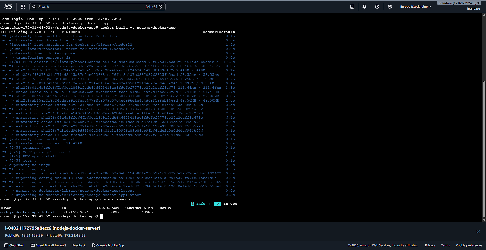
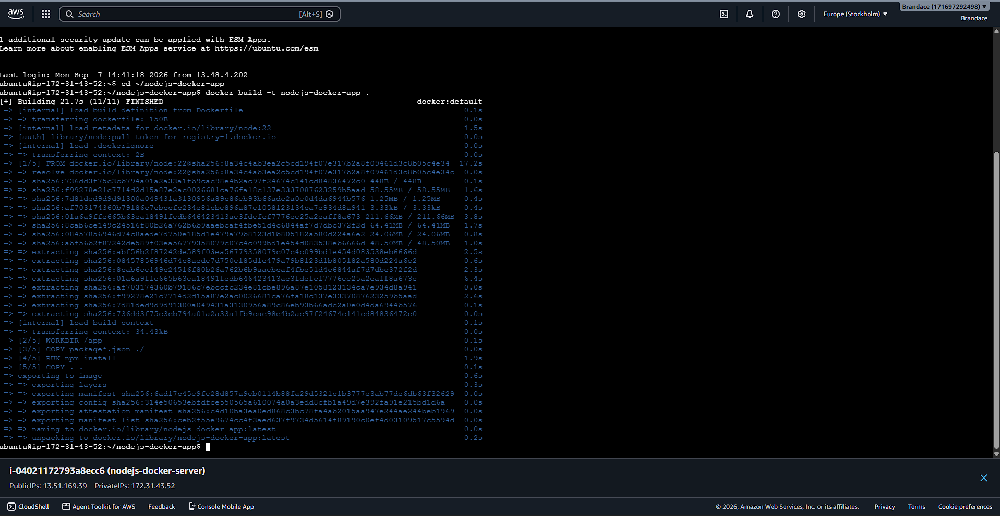
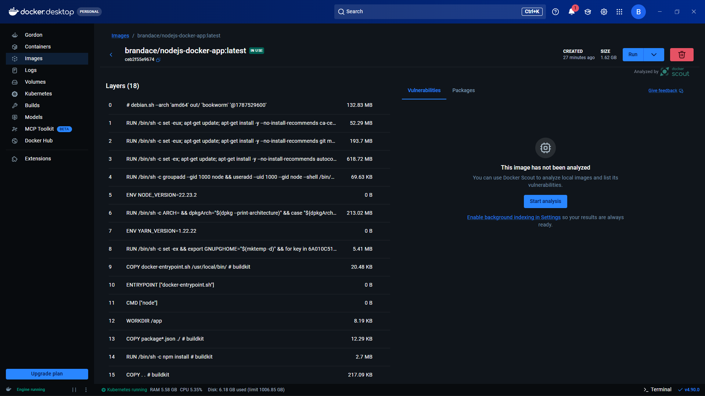
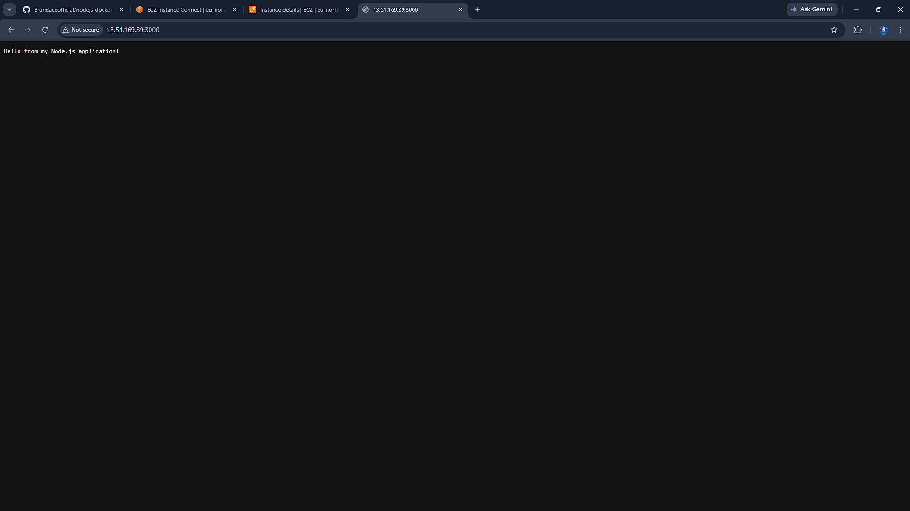
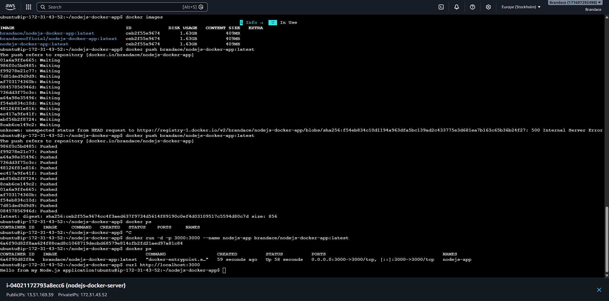
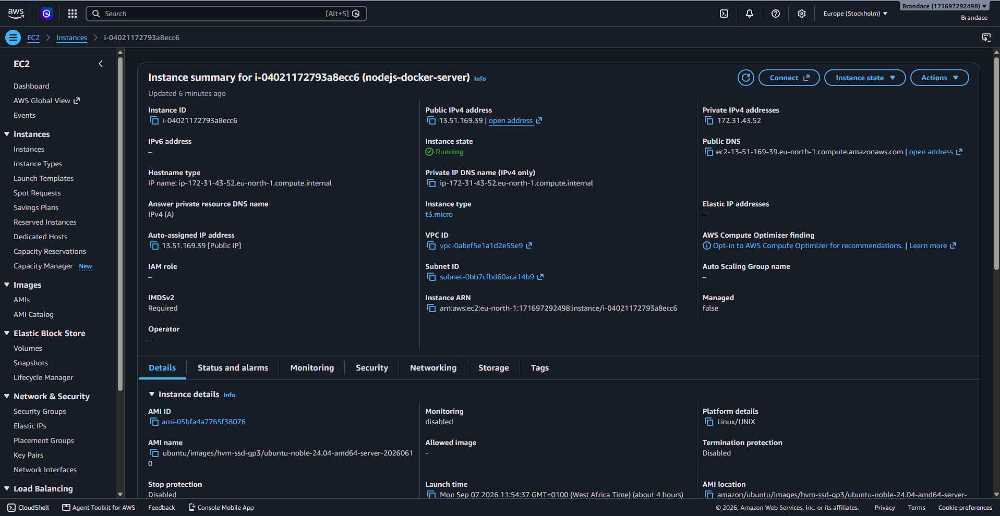
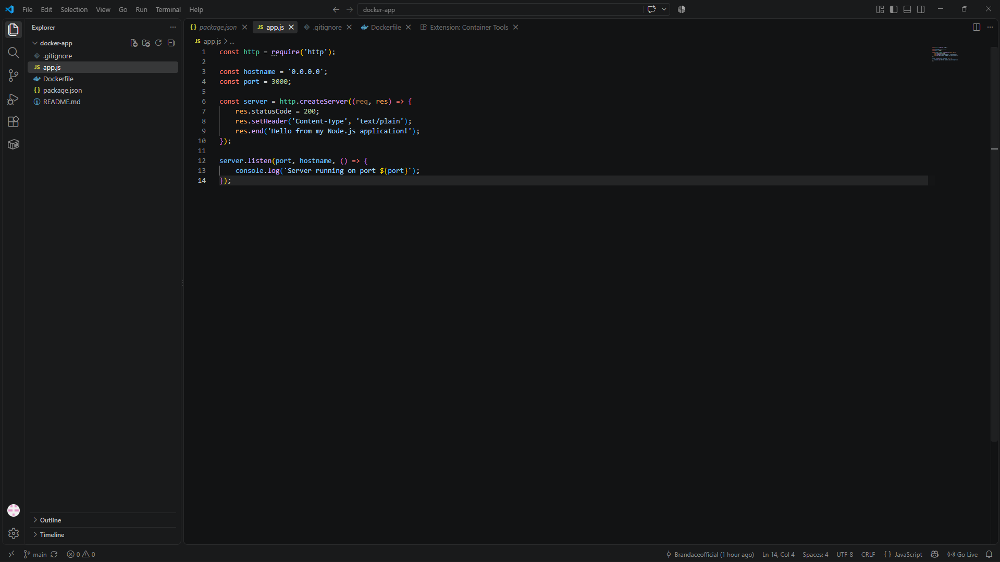

# nodejs-docker-app

## 1. Docker Build

The Docker image was built using:

docker build -t brandace/nodejs-docker-app:1.0 .

## 2. Docker Hub Image

The Docker image was successfully uploaded to Docker Hub.

## 3. Running Docker Container

The container was started and verified using:

docker ps

### 3. Save everything

In VS Code:

**Ctrl + S**

Then, because your project is connected to GitHub, run:

git add README.md screenshots/

##Source Code

